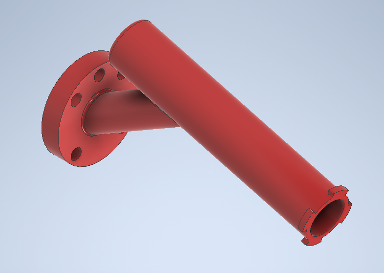
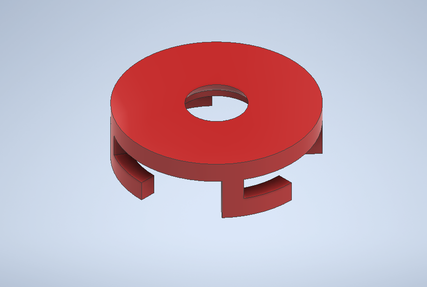

# Laboratorio No. 01 — Robótica Industrial
### Trayectorias, Entradas y Salidas Digitales
**Universidad Nacional de Colombia · Robótica 2026-I**

---

## Integrantes

| Nombre | URL del Repositorio |
|--------|-------------------|
| Julian Benitez | *(agregar URL)* |
| Juan Salamanca | *(agregar URL)* |

---

## Descripción de la Solución

El proyecto consiste en la **decoración automatizada de una torta virtual** usando un robot industrial ABB IRB 140 programado en RAPID. El robot, equipado con un marcador fijado al flanche junto con una herramienta diseñada por los integrantes del equipo, traza los nombres de los integrantes del grupo letra por letra sobre una superficie plana, usando trayectorias continuas y controladas mediante señales digitales de entrada y salida.

### Flujo general del sistema

1. El sistema espera una **señal digital de entrada (DI_01 = 1)** para iniciar la rutina de decorado.
2. El robot ejecuta secuencialmente las trayectorias de cada letra: **J, U, L, I, A, N** (primer nombre) y **F, E, L, I, P, E** (segundo nombre) y luego una figura, en este caso una cara feliz, regresando a la posición `Home_b` entre cada letra.
3. Al finalizar, se activa la **señal de salida (DI_02 = 1)** y el robot espera confirmación para terminar.
4. Una segunda señal controla el **transporte del pastel** mediante una banda transportadora.

### Restricciones cumplidas

- Velocidades entre **v100 y v200** (dentro del rango 100–1000)
- Zona de error máxima **z10** (en posiciones de transición) y **z1** (en trazado)
- Movimiento parte y finaliza desde la posición **Home**
- Cada nombre escrito como trazos continuos con retorno a `Home_b` entre letras
- Trayectorias definidas sobre el **workobject `julian_wobj`** (torta virtual)

---

## Estructura del Repositorio

```
Lab01_Robotica/
├── README.md
├── codigo/
│   └── Module1.mod          # Módulo RAPID principal
├── herramienta/
│   ├── diseño_CAD.*         # Modelo CAD del porta-marcador
│   └── tooldata.txt         # Parámetros del TCP calibrado
├── diagramas/
│   ├── diagrama_flujo.png   # Diagrama de flujo del programa
│   └── plano_planta.png     # Plano de ubicación de elementos
└── video/
    └── link_video.txt       # Enlace a la simulación y práctica real
```

---

## Herramienta Diseñada

Se diseñó y construyó un **porta-marcador** para fijar al flanche del robot IRB 140. Este se diseña para impresión 3D en ácido poliláctico (PLA) y está compuesto de 2 partes, una base con la geometría de fijación adecuada para el flanche y una extensión cilíndrica con la cavidad perfecta para el marcador, esta posee redondeos en bordes agudos para disminuir concentradores de esfuerzos además de unas pestañas en la punta del cilindro para la postura de la tapa y fijación del marcador.


<p align="center">
  <br>
  <em>Modelado base del porta-marcador</em>
</p>

Como segunda pieza complementaria se diseña una tapa que permitirá posicionar el marcador dentro de la cavidad, esta posee la geometría coincidente para acoplarse correctamente con las pestañas de la pieza anterior.

<p align="center">
  <br>
  <em>Modelado tapa del porta-marcador</em>
</p>

Luego de la impresión 3D las piezas identicas al modelado se observan a continuación.

<p align="center">
  <br>
  <em>Porta-marcador impreso y ensamblado</em>
</p>


Los datos del TCP calibrado (Tooldata) son:
```rapid
PERS tooldata Marcador := [
  TRUE,
  [[-7.328, 3.211, 174.388], [0.991444861, 0, 0.130526192, 0]],
  [1, [0, 0, 1], [1, 0, 0, 0], 0, 0, 0]
];
```

- **TCP (mm):** X = -7.328, Y = 3.211, Z = 174.388  
- **Orientación:** rotación de ~7.5° sobre el eje Y (ajuste por inclinación del marcador)  
- **Calibración:** realizada usando la técnica de 4 puntos (TCP) en el robot real y comparada con RobotStudio mediante importación del modelo CAD.

---

## Workobject

Se definió el workobject `julian_wobj` que ubica la torta virtual sobre la superficie de trabajo:

```rapid
TASK PERS wobjdata julian_wobj := [
  FALSE, TRUE, "",
  [[0, 0, 0], [1, 0, 0, 0]],
  [[-653, 300, 382], [0.00753222, 0.999657, 0.000022491, -0.0250846]]
];
```

Las trayectorias de escritura se definen en coordenadas **locales del workobject** (plano Z=0), lo que permite reutilizarlas fácilmente en otro workobject para el cuadrante x(+), y(−).

---

## Entradas y Salidas Digitales

| Señal | Tipo | Función |
|-------|------|---------|
| `DO_01` | Entrada digital | Inicia la rutina de decorado |
| `DO_02` | Entrada digital | Activa pose de mantenimiento |
| `DI_02` | Salida digital | Indica que el decorado finalizó / enciende luz |
| `DI_01` | Salida digital | Controla la banda transportadora |

### Lógica de control (resumen)

```
Esperar DO_01 = 1
  → Ejecutar trayectorias de decorado
  → Regresar a Home_b
  → Activar DI_02 = 1 (luz encendida)
  → Esperar DO_01 = 0

Si DI_02 = 1:
  → Apagar DI_01
  → Esperar DO_02 = 1 (señal para mantenimiento)
```

---

## Descripción de Funciones RAPID Utilizadas

### Instrucciones de movimiento

| Función | Descripción |
|---------|-------------|
| `MoveJ` | Movimiento en espacio articular (joint). Usado para desplazamientos grandes sin restricción de trayectoria cartesiana (ej. ir a `Home_b`). |
| `MoveL` | Movimiento lineal en espacio cartesiano. Usado para trazar los segmentos rectos de cada letra. |
| `MoveC` | Movimiento circular en espacio cartesiano. Requiere un punto intermedio y un punto final. Usado para las curvas de letras como **J**, **U**, **P**, **C**, **B**. |
| `MoveAbsJ` | Movimiento a posición articular absoluta. Útil para ir a la posición home con todos los ángulos en 0°. |

### Control de flujo

| Función | Descripción |
|---------|-------------|
| `WHILE TRUE DO ... ENDWHILE` | Bucle infinito principal del programa. El robot siempre queda en espera de una señal. |
| `IF ... THEN ... ENDIF` | Condicional para verificar el estado de las señales digitales antes de ejecutar rutinas. |
| `WaitDI` | Pausa la ejecución hasta que una señal digital de entrada alcance el valor especificado. |
| `WaitTime` | Pausa la ejecución por un tiempo determinado (en segundos). |

### Entradas y salidas digitales

| Función | Descripción |
|---------|-------------|
| `SetDO` | Establece el valor (0 o 1) de una señal digital de salida. |
| `WaitDI` | Espera hasta que una señal digital de entrada tome el valor especificado. |

### Tipos de datos usados

| Tipo | Descripción |
|------|-------------|
| `robtarget` | Define una posición y orientación del TCP en el espacio. Incluye posición [x,y,z], cuaternión de orientación, configuración del robot y ejes externos. |
| `wobjdata` | Define un objeto de trabajo (sistema de coordenadas de la pieza). Permite reutilizar trayectorias en distintas ubicaciones. |
| `tooldata` | Define los datos de la herramienta: posición del TCP y masa/inercia. |

---

## Letras y Trayectorias

### Primer nombre — JULIAN

| Letra | Procedimientos | Tipo de trayectoria |
|-------|---------------|-------------------|
| J | `Path_J_1`, `Path_J_2` | Línea + arco (MoveL + MoveC) |
| U | `Path_U_1`, `Path_U_2`, `Path_U_3` | Líneas + arco inferior |
| L | `Path_L_1`, `Path_L_2` | Dos líneas (vertical + horizontal) |
| I | `Path_I` | Línea horizontal simple |
| A | `Path_A_1`, `Path_A_2`, `Path_A_3` | Dos diagonales + travesaño |
| N | `Path_N_1`, `Path_N_2`, `Path_N_3` | Tres segmentos (dos verticales + diagonal) |

### Segundo nombre — FELIPE 

| Letra | Procedimientos | Tipo de trayectoria |
|-------|---------------|-------------------|
| F | `Path_F_1`, `Path_F_2`, `Path_F_3` | Líneas (vertical + horizontales) |
| E | `Path_E_1`–`Path_E_4` | Líneas (vertical + tres horizontales) |
| L | `Path_L_11`, `Path_L_12` | Dos líneas |
| I | `Path_I_11` | Línea simple |
| P | `Path_P_1`–`Path_P_4` | Líneas + semicírculo (MoveC) |
| E | `Path_E_11`–`Path_E_14` | Líneas (vertical + tres horizontales) |

### Dibujo — CARA FELIZ *(decoración)*
| Letra | Procedimientos | Tipo de trayectoria |
|-------|---------------|-------------------|
| O | `Path_O_1`, `Path_O_2` | Se reprensenta los ojos de la figura dos lineas |
| B | `Path_B_1`, `Path_B_2` | Línea + arco representando la boca de la figura |
| C grande | `Path_C_1`, `Path_C_2` | Dos arcos MoveC (círculo completo) repesenta el contorno de la cara feliz|
| C pequeño | `Path_C_3`, `Path_C_4` | Dos arcos MoveC (círculo completo) repesenta el contorno de la cara feliz|

### Home

| Procedimiento | Descripción |
|--------------|-------------|
| `Path_Home_b` | Lleva el robot a la posición segura de transición entre letras (z = -100 en el WObj). Usa `MoveL` a v200, z10. |
| `Path_Home` | Lleva el robot a la posición home global con `tool0` y `wobj0`. |

---


## Referencias

- ABB Robotics. *RAPID Reference Manual — Instructions, Functions and Data types*. 2024.
- ABB Robotics. *IRB 140 Product Specification*.
- RobotStudio v5+, ABB Group.
